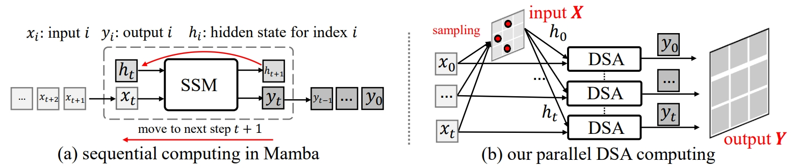

# PVMamba: Parallelizing Vision Mamba via Dynamic State Aggregation

If you have any questions, please don't hesitate to contact me  (jaffe031@sjtu.edu.cn). 

## To Do List

- [x] 2025.06 PVMamba is accepted by ICCV.
- [x] 2025.06 Enhance PVMamba by [DCNv4](https://arxiv.org/pdf/2211.05778) operator!
- [ ] Publish the paper. 
- [ ] Release the raw code. 


## Introduction of PVMamba

<p align="center">

</p>

Mamba, an architecture with RNN-like sequence modeling of State Space Model (SSM), has demonstrated promising capabilities in long-range modeling with high efficiency. However, Mamba models struggle with structured 2D visual data using sequential computing, thereby lagging behind their attention-based counterparts. In this paper, we propose a Parallel Vision Mamba (PVMamba), a novel SSM architecture tailored for visual data. PVMamba encompasses two key designs: 1) Based on the sparsity and adjacency of visual signals, we parallelize the sequential computing through three core steps, termed Dynamic State Aggregation (DSA), i.e., parallelization, alignment, and aggregation. DSA generates the hidden state in SSM by a feasible spatial aggregation, thereby overcoming the inherent sequential constraints. 2) Along with maintaining linear computational complexity, we apply a dynamic operator to learn the spatial samplings for each hidden state. To further boost the local modeling capability, we restrict the dynamic operator to the neighboring pixels in shallow layers. We also devise a layer multiplexing technique to stabilize the training and reduce the learning redundancy. PVMamba is a versatile backbone network with dynamic operators for various vision tasks, such as image classification and dense prediction.

## Getting Started

### Installation

The installation tips can also be referred to [VMamba](https://github.com/MzeroMiko/VMamba/tree/main). 

**Environment Setup:**

VMamba recommends setting up a conda environment and installing dependencies via pip. Use the following commands to set up your environment:
Also, We recommend using the pytorch>=2.0, cuda>=11.8. But lower version of pytorch and CUDA are also supported.

***Create and activate a new conda environment***

```bash
conda create -n quadmamba
conda activate quadmamba
```

***Install Dependencies***

for SSM library, please do as follows:

```bash
pip install -r requirements.txt
cd kernels/selective_scan && pip install .
```
For DCNv4 library, please do as follows:

```bash
cd kernels
unzip DCNv4_op.zip
cd kernels/DCNv4_op && pip install .
cp ./dcnv4.py kernels/DCNv4_op/DCNv4/modules/dcnv4.py
```

***Dependencies for `Detection` and `Segmentation` (optional)***

```bash
pip install mmengine==0.10.1 mmcv==2.1.0 opencv-python-headless ftfy regex
pip install mmdet==3.3.0 mmsegmentation==1.2.2 mmpretrain==1.2.0
```

### Model Training and Inference

**Classification**

To train QuadMamba models for classification on ImageNet, use the following commands for different configurations:

```bash
python -m torch.distributed.launch --nnodes=1 --node_rank=0 --nproc_per_node=8 --master_addr="127.0.0.1" --master_port=29501 main.py --cfg </path/to/config> --batch-size 128 --data-path </path/of/dataset> --output /tmp
```

If you only want to test the performance (together with params and flops):

```bash
python -m torch.distributed.launch --nnodes=1 --node_rank=0 --nproc_per_node=1 --master_addr="127.0.0.1" --master_port=29501 main.py --cfg </path/to/config> --batch-size 128 --data-path </path/of/dataset> --output /tmp --pretrained </path/of/checkpoint>
```


To train with `mmdetection` or `mmsegmentation`:
```bash
bash ./tools/dist_train.sh </path/to/config> 8
```

## Citation

If you find it useful, please consider to cite the paper, thanks!

```

@article{xie2025pvmamba,
    title={PVMamba: Parallelizing Vision Mamba via Dynamic State Aggregation},
    author={Xie, Fei and Wang, Zhongdao and Zhang, Weijia and Ma, Chao},
    journal={Proceedings of the IEEE/CVF International Conference on Computer Vision},
    year={2025}
}

```

## Acknowledgment

This project is based on [VMamba](https://github.com/MzeroMiko/VMamba/tree/main) and [DCNv4](https://arxiv.org/pdf/2211.05778). Thanks for their great work!


